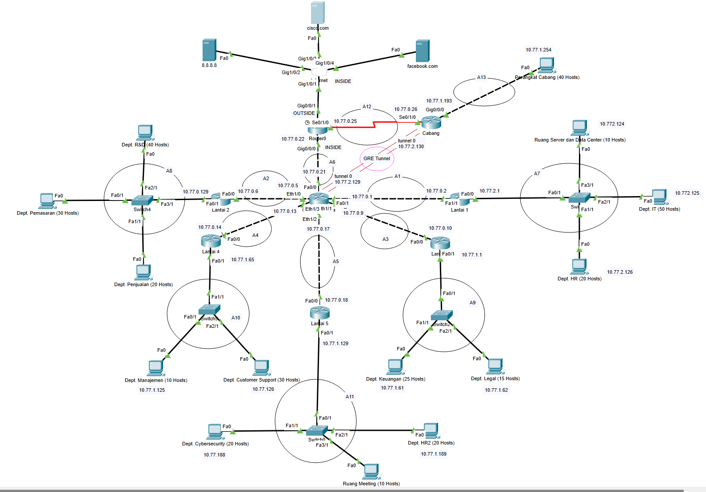
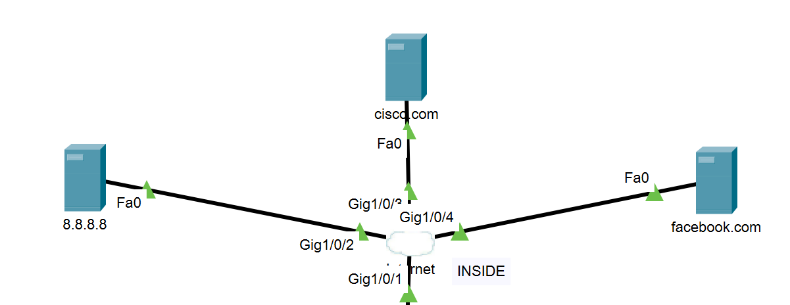
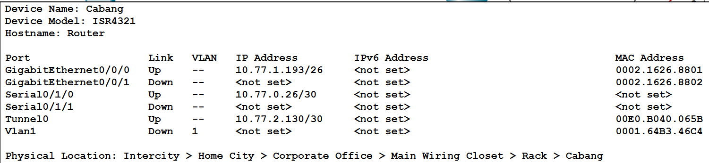
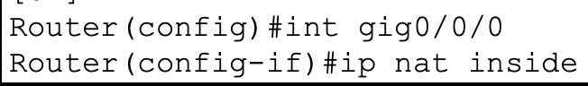
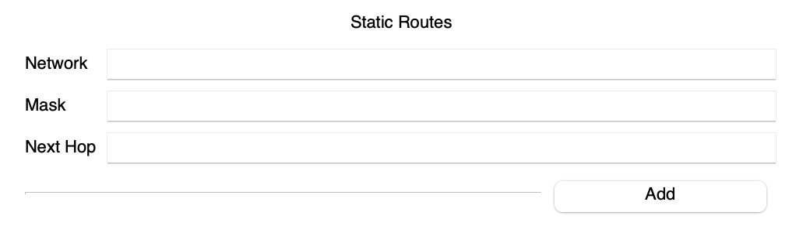
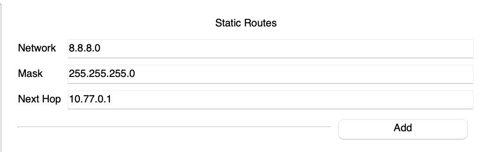
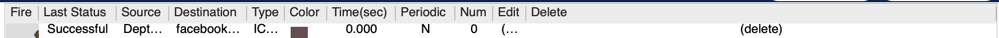
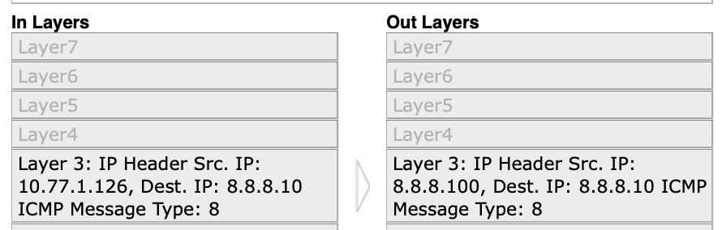

# Final Project Jaringan Komputer 2024 (A)

## Anggota Kelompok

| No  | Nama Anggota             | NRP        |
| --- | ------------------------ | ---------- |
| 1   | Danendra Fidel Khansa    | 5027231063 |
| 2   | Tio Axellino Irin        | 5027231065 |
| 3   | Hazwan Adhikara Nasution | 5027231017 |
| 4   | Rafael Gunawan           | 5027231019 |

## SOAL

Perusahaan ARA Tech tengah mengalami pertumbuhan yang pesat dan memerlukan
infrastruktur jaringan yang handal untuk mendukung kelancaran operasionalnya. Saat ini,
perusahaan memiliki satu gedung utama yang terdiri dari lima lantai, dengan masing-masing
lantai dihuni oleh dua hingga tiga departemen yang memiliki kebutuhan perangkat berbeda.

### Lantai 1: Infrastruktur dan Operasional

- **Departemen IT**: 50 perangkat
- **Departemen HR**: 20 perangkat
- **Ruang Server dan Data Center**: 10 perangkat

### Lantai 2: Pengembangan dan Pemasaran

- **Departemen R&D**: 40 perangkat
- **Departemen Pemasaran**: 30 perangkat
- **Departemen Penjualan**: 20 perangkat

### Lantai 3: Keuangan dan Legal

- **Departemen Keuangan**: 25 perangkat
- **Departemen Legal**: 15 perangkat

### Lantai 4: Manajemen dan Dukungan Pelanggan

- **Departemen Manajemen**: 10 perangkat
- **Departemen Customer Support**: 30 perangkat

### Lantai 5: Keamanan dan Sumber Daya Manusia

- **Departemen Cybersecurity**: 20 perangkat
- **Departemen HR**: 20 perangkat
- **Ruang Meeting**: 10 perangkat

Selain itu, perusahaan juga memiliki satu cabang di kota lain yang memerlukan koneksi ke
gedung utama melalui jaringan VPN. Di cabang tersebut, terdapat satu subnet yang
mencakup seluruh perangkat di cabang (sekitar 40 perangkat).

## 1. Topologi

yang mencakup gedung utama dengan lima lantai dan
cabang yang terhubung melalui VPN di Cisco Packet Tracer. Gunakan perangkat
jaringan yang sesuai (misalnya router, switch, dan perangkat lain) untuk membangun
topologi tersebut. **(20 poin)**



## 2. Rute Subnet

Subnetting pada jaringan dan tentukan Subnet Mask, Network ID,
Broadcast Address, serta Range IP untuk setiap subnet. Buatlah tabel alokasi subnet
untuk setiap departemen berdasarkan jumlah perangkat yang dibutuhkan di masingmasing subnet. Gunakan alamat IP Private sesuai dengan standar yang ada (misalnya
10.0.0.0/8, 172.16.0.0/12, atau 192.168.0.0/16). **(15 poin)**

| **Nama Subnet** | **Rute**                                                           | **Jumlah IP** | **Netmask**       |
| --------------- | ------------------------------------------------------------------ | ------------- | ----------------- |
| A1              | GedungUtama > Lantai 1                                             | 2             | 255.255.255.252   |
| A2              | GedungUtama > Lantai 2                                             | 2             | 255.255.255.252   |
| A3              | GedungUtama > Lantai 3                                             | 2             | 255.255.255.252   |
| A4              | GedungUtama > Lantai 4                                             | 2             | 255.255.255.252   |
| A5              | GedungUtama > Lantai 5                                             | 2             | 255.255.255.252   |
| A6              | GedungUtama > Router0                                              | 2             | 255.255.255.252   |
| A7              | Lantai 1 > Switch3 > Server&DataCenter > Dept. IT > Dept. HR       | 81            | 255.255.255.128   |
| A8              | Lantai 2 > Switch4 > Dept. R&D > Dept. Pemasaran > Dept. Penjualan | 91            | 255.255.255.128   |
| A9              | Lantai 3 > Switch2 > Dept. Keuangan > Dept. Legal                  | 41            | 255.255.255.192   |
| A10             | Lantai 4 > Switch5 > Dept. Manajemen > Dept. CS                    | 41            | 255.255.255.192   |
| A11             | Lantai 5 > Switch0 > Dept. Cysec > Dept. HR2 > R. Meeting          | 51            | 255.255.255.192   |
| A12             | Router1 > Cabang                                                   | 2             | 255.255.255.252   |
| A13             | Cabang > Perangkat Cabang                                          | 41            | 255.255.255.192   |
| **Total**       |                                                                    | **360**       | **255.255.254.0** |

## Pembagian IP | VLSM |

| **Subnet** | **Jumlah IP** | **Netmask** | **Network ID** | **Broadcast** | **Range IP**              | **Subnet Mask** |
| ---------- | ------------- | ----------- | -------------- | ------------- | ------------------------- | --------------- |
| A1         | 2             | /30         | 10.77.0.0      | 10.77.0.3     | 10.77.0.1 - 10.77.0.2     | 255.255.255.252 |
| A2         | 2             | /30         | 10.77.0.4      | 10.77.0.7     | 10.77.0.5 - 10.77.0.6     | 255.255.255.252 |
| A3         | 2             | /30         | 10.77.0.8      | 10.77.0.11    | 10.77.0.9 - 10.77.0.10    | 255.255.255.252 |
| A4         | 2             | /30         | 10.77.0.12     | 10.77.0.15    | 10.77.0.13 - 10.77.0.14   | 255.255.255.252 |
| A5         | 2             | /30         | 10.77.0.16     | 10.77.0.19    | 10.77.0.17 - 10.77.0.18   | 255.255.255.252 |
| A6         | 2             | /30         | 10.77.0.20     | 10.77.0.23    | 10.77.0.21 - 10.77.0.22   | 255.255.255.252 |
| A12        | 2             | /30         | 10.77.0.24     | 10.77.0.27    | 10.77.0.25 - 10.77.0.26   | 255.255.255.252 |
| A7         | 81            | /25         | 10.77.2.0      | 10.77.2.127   | 10.77.2.1 - 10.77.2.126   | 255.255.255.128 |
| A8         | 91            | /25         | 10.77.0.128    | 10.77.0.255   | 10.77.0.129 - 10.77.0.254 | 255.255.255.128 |
| A9         | 41            | /26         | 10.77.1.0      | 10.77.1.63    | 10.77.1.1 - 10.77.1.62    | 255.255.255.192 |
| A10        | 41            | /26         | 10.77.1.64     | 10.77.1.127   | 10.77.1.65 - 10.77.1.126  | 255.255.255.192 |
| A11        | 51            | /26         | 10.77.1.128    | 10.77.1.191   | 10.77.1.129 - 10.77.1.190 | 255.255.255.192 |
| A13        | 41            | /26         | 10.77.1.192    | 10.77.1.255   | 10.77.1.193 - 10.77.1.254 | 255.255.255.192 |
| GRE TUNNEL | 2             | /30         | 10.77.2.128    | 10.77.2.131   | 10.77.2.129 - 10.77.2.130 | 255.255.255.252 |

[Spreadsheet Pembagian IP | VLSM |](https://docs.google.com/spreadsheets/d/1JpLVpSvkCfJNxGBvMkfkIv3K3mBEaEyyrNaPk9eCnj8/edit?usp=sharing)

## 3. Konfigurasi Static IP

pada setiap perangkat jaringan di semua departemen, kecuali
lantai 2, sesuai dengan pembagian subnetting yang telah dilakukan. Pastikan alamat
IP yang diberikan sesuai dengan alokasi subnet yang sudah dibuat. **(10 poin)**

### Gedung Utama


### Lantai 1


Client Lantai 1


### Lantai 2


Client Lantai 2


### Lantai 3


Client Lantai 3


### Lantai 4


Client Lantai 4


### Lantai 5


Client Lantai 5


### Router0 (NAT)


Internet NAT


### Cabang



Client Cabang


## 4. Konfigurasi DHCP Lantai 2

Departemen R&D, Pemasaran, dan Penjualan akan menggunakan DHCP untuk
mengalokasikan alamat IP secara dinamis kepada perangkat mereka. Konfigurasikan
DHCP server pada router dan pastikan perangkat di tiga departemen tersebut
mendapatkan IP otomatis sesuai dengan rentang yang telah ditentukan. **(15 poin)**

## 5. Konfigurasi Static Routing

agar perangkat di setiap departemen dapat berkomunikasi
lintas subnet. Jangan menggunakan default route untuk menghubungkan subnetsubnet yang ada. Pastikan setiap router pada masing-masing lantai terhubung dengan
benar dan dapat melakukan routing antar subnet. **(15 poin)**

### Routing Gedung Utama


### Routing Lantai 1


### Routing Lantai 2


### Routing Lantai 3


### Routing Lantai 4


### Routing Lantai 5


### Routing Router0 (NAT)


### Routing Cabang


## 6. Konfigurasi NAT Overload (PAT)

Perusahaan membutuhkan akses ke internet untuk semua perangkat yang terhubung.
Konfigurasikan NAT Overload (PAT) pada router utama untuk memungkinkan
perangkat dalam jaringan lokal mengakses internet, misalnya dengan melakukan ping
ke 8.8.8.8. **(15 poin)**

> `Inti dari bagian ini adalah bagaimana cara agar jaringan lokal dapat mengakses internet melalui NAT (Network Address Translation). Jadi, ketika client pada jaringan lokal ingin mengakses internet, IP Local tersebut perlu di translate terlebih dahulu ke IP Public`

_Konfigurasi pada "Router0"_

1. Masuk CLI, lalu jalankan command

   

   > melihat dari topologi, bagian bawah dari Router0 adalah jaringan lokal yang melalui gig0/0/0

2. Kita juga perlu untuk mengatur NAT untuk jaringan public

   

   > sama seperti sebelumnya, namun sekarang kita handle jaringan public yang berada di atas Router0

3. `exit` pada CLI, lalu agar NAT berjalan dan bisa untuk translate IP. Jalankan command ini untuk translate IP Local ke IP Public ataupun sebaliknya

```
ip nat inside source list 1 interface GigabitEthernet0/0/1 overload
```


4. Pastikan untuk membuat `access-list 1` agar bisa diakses dengan cara `access-list [nomor-list] permit any`


5. Jangan lupa untuk menambahkan DNS Server `8.8.8.8` pada setiap client

6. Setelah itu, kita perlu untuk menambahkan Static Route pada setiap router di jaringan lokal, agar bisa mengakses internet dengan cara:



`- Network = 8.8.8.0 (Internet)`

`- Mask = 255.255.255.0`

`- Next Hop = [Sesuaikan dengan jalur masuk routernya]`

> Contoh:



> Reference: https://medium.com/@romanyoga4/konfigurasi-static-nat-di-cisco-packet-tracer-belajar-menjadi-network-engineer-part-26-03dc026ac24b

7. Terakhir, kita lakukan test ping dan mengecek apakah terjadi IP Translation

`departemen customer service ke facebook.com`

> 

`IP Translation`

> 

## 7. Konfigurasi Generic Routing Encapsulation (GRE Tunnel)

Hubungkan Gedung Utama ke Cabang menggunakan GRE Tunnel. Konfigurasikan
Generic Routing Encapsulation (GRE Tunnel) antara router di gedung utama dan
router di cabang untuk membangun koneksi virtual yang aman. Pastikan kedua router
dapat saling berkomunikasi melalui GRE Tunnel dan verifikasi konektivitasnya dengan
melakukan ping antar router atau perangkat di masing-masing jaringan. (10 poin)
